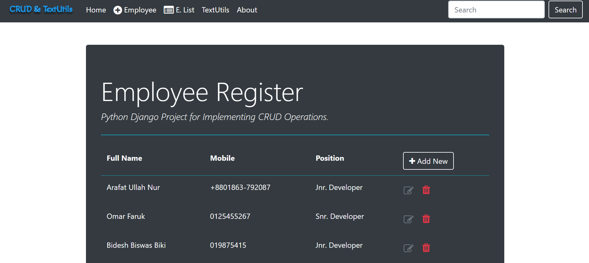
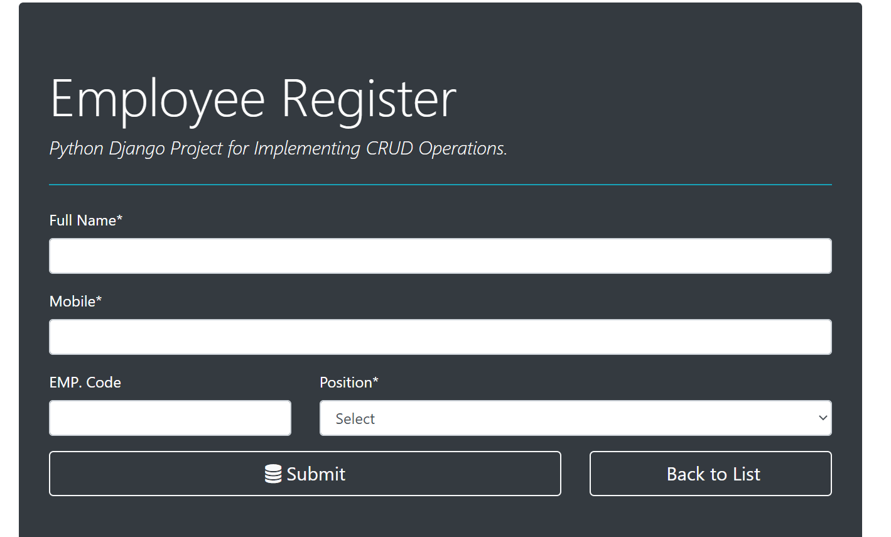

# CRUD Operations and Text-Utils
*In this repositories i implemented CRUD operation and also made an app called TextUtils. This is an open source project, you can fork it and can give pull request. If you like this project then please do follow.*

# Features
* Employee register.
* Employee Creat, Read, Update, Delete. 
* User-friendly.
* I will update it later.....

# Tools
## Front-end Part
* HTML
* CSS
* Bootstrap
## Back-end
* Django
* SQLite 3

# Screenshots of the Project

  
  

**Copyright (c)** 2020-3020 Md. Omar Faruk

## Go Through This Site Then You Will Know About This Site Properly.

**This is an Open source project. You can fork it.**

